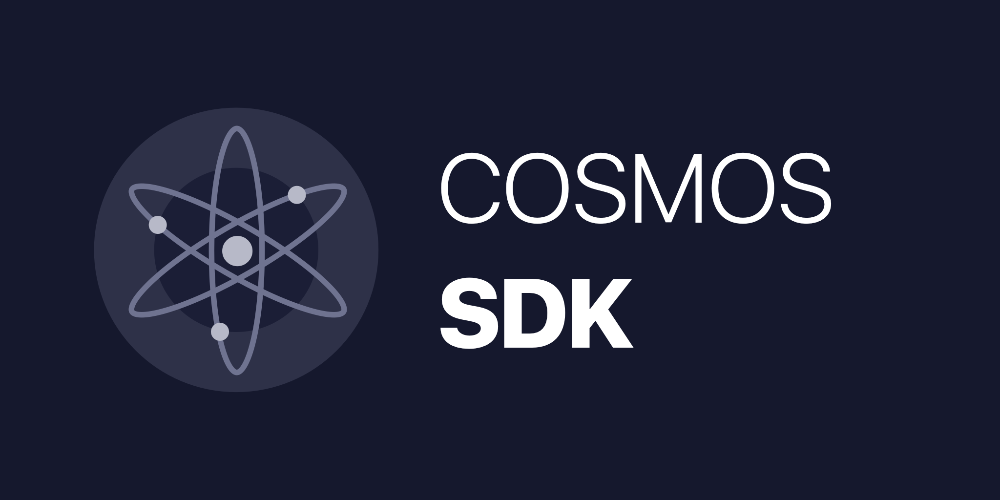

<<<<<<< HEAD
# crypto

crypto is the cryptographic package adapted for Tendermint's uses

## Importing it
To get the interfaces,
`import "github.com/tendermint/tendermint/crypto"`

For any specific algorithm, use its specific module e.g.
`import "github.com/tendermint/tendermint/crypto/ed25519"`

If you want to decode bytes into one of the types, but don't care about the specific algorithm, use
`import "github.com/tendermint/tendermint/crypto/amino"`

## Binary encoding

For Binary encoding, please refer to the [Tendermint encoding spec](https://github.com/tendermint/tendermint/blob/master/docs/spec/blockchain/encoding.md).

## JSON Encoding

crypto `.Bytes()` uses Amino:binary encoding, but Amino:JSON is also supported.

```go
Example Amino:JSON encodings:

ed25519.PrivKeyEd25519     - {"type":"954568A3288910","value":"EVkqJO/jIXp3rkASXfh9YnyToYXRXhBr6g9cQVxPFnQBP/5povV4HTjvsy530kybxKHwEi85iU8YL0qQhSYVoQ=="}
ed25519.PubKeyEd25519      - {"type":"AC26791624DE60","value":"AT/+aaL1eB0477Mud9JMm8Sh8BIvOYlPGC9KkIUmFaE="}
crypto.PrivKeySecp256k1   - {"type":"019E82E1B0F798","value":"zx4Pnh67N+g2V+5vZbQzEyRerX9c4ccNZOVzM9RvJ0Y="}
crypto.PubKeySecp256k1    - {"type":"F8CCEAEB5AE980","value":"A8lPKJXcNl5VHt1FK8a244K9EJuS4WX1hFBnwisi0IJx"}
```
=======
# Cosmos SDK


[](https://github.com/cosmos/cosmos-sdk/releases/latest)
[](https://circleci.com/gh/cosmos/cosmos-sdk/tree/master)
[](https://codecov.io/gh/cosmos/cosmos-sdk)
[](https://goreportcard.com/report/github.com/cosmos/cosmos-sdk)
[](https://github.com/cosmos/cosmos-sdk/blob/master/LICENSE)
[](https://github.com/cosmos/cosmos-sdk)
[](https://godoc.org/github.com/cosmos/cosmos-sdk)
[](https://riot.im/app/#/room/#cosmos-sdk:matrix.org)

The Cosmos-SDK is a framework for building blockchain applications in Golang.
It is being used to build `Gaia`, the first implementation of the [Cosmos Hub](https://cosmos.network/docs/),

**WARNING**: The SDK has mostly stabilized, but we are still making some
breaking changes.

**Note**: Requires [Go 1.10+](https://golang.org/dl/)

## Gaia Testnet

To join the latest testnet, follow 
[the guide](https://cosmos.network/docs/getting-started/full-node.html#setting-up-a-new-node).

For status updates and genesis files, see the
[testnets repo](https://github.com/cosmos/testnets).

## Install

See the 
[install instructions](https://cosmos.network/docs/getting-started/installation.html).

## Quick Start

See the [Cosmos Docs](https://cosmos.network/docs/)

- [Getting started with the SDK](https://cosmos.network/docs/sdk/core/intro.html)
- [SDK Examples](/examples)
- [Join the testnet](https://cosmos.network/docs/getting-started/full-node.html#run-a-full-node)

## Disambiguation

This Cosmos-SDK project is not related to the [React-Cosmos](https://github.com/react-cosmos/react-cosmos) project (yet). Many thanks to Evan Coury and Ovidiu (@skidding) for this Github organization name. As per our agreement, this disambiguation notice will stay here.
>>>>>>> 1c38c70468ec721e3a555ba2f3bf5f9da31f0cc9
